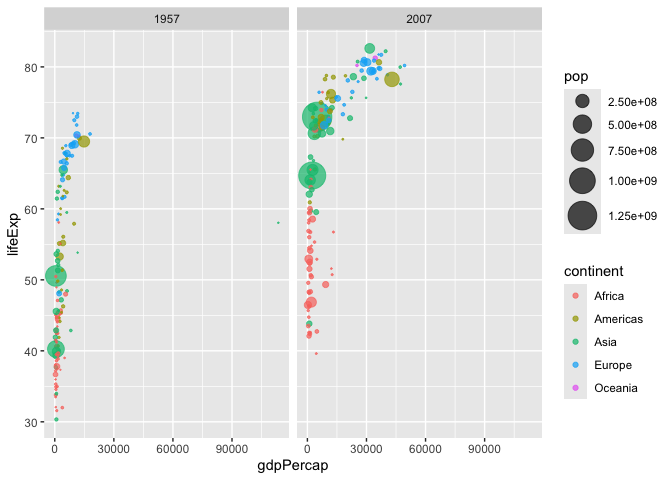

# Class 05: Data Vizualization with GGPLOT
Gaeun (PID: A16814573)

Questions:

> Q. For which phases is data visualization important in our scientific
> workflows?

Communication of Results, Exploratory Data Analysis, Detection of
outliers

> Q. True or False? The ggplot2 package comes already installed with R?

False

> Q. Which plot types are typically NOT used to compare distributions of
> numeric variables?

Network graphs

> Q. Which statement about data visualization with ggplot2 is incorrect?

ggplot2 is the only way to create plots in R

## Plotting in R

R has lots of ways to make plots and figures. This includes so-called
**base** graphics and packages like **ggplot2**

``` r
plot(cars)
```


This is a **base** R plot of the in-built `cars` dataset that has only
two columns:

``` r
head(cars)
```

      speed dist
    1     4    2
    2     4   10
    3     7    4
    4     7   22
    5     8   16
    6     9   10

> Q. How would we plot this wee dataset with **ggplot2**?

All ggplot figures have at least 3 layers:

\-**data**

\-**aes** (how the data maps to the plot)

\-**geoms** (how we draw the plot, lines, points, etc.)

Before I use any new package (like ggplot), I need to download and
install it with the `install.packages()` command.

I never use `install.packages()` within my quarto document (the line of
code), otherwise I will install the package over and over again - which
is silly! I install it in the Console.

Once a package is installed I can load it up with the `library()`
function.

``` r
# install.packages("ggplot2")
library(ggplot2)

ggplot(cars) +
  aes(x=speed, y=dist) +
  geom_point()
```


**Key-point**: For simple plots (like the one above), ggplot is more
verbose (we need to do more typing), but as plots get more complicated,
ggplot starts to be more clear and simple than base R plot()

> Q. Which geometric layer should be used to create scatter plots in
> ggplot2?

geom_point()

> Q. In your own RStudio can you add a trend line layer to help show the
> relationship between the plot variables with the geom_smooth()
> function?

``` r
ggplot(cars) +
  aes(x=speed, y=dist) +
  geom_point() +
  geom_smooth()
```

    `geom_smooth()` using method = 'loess' and formula = 'y ~ x'


> Q. Argue with geom_smooth() to add a straight line from a linear model
> without the shaded standard error region?

``` r
ggplot(cars) +
  aes(x=speed, y=dist) +
  geom_point() +
  geom_smooth(method="lm", se=FALSE)
```

    `geom_smooth()` using formula = 'y ~ x'


> Q. Can you finish this plot by adding various label annotations with
> the labs() function and changing the plot look to a more conservative
> “black & white” theme by adding the theme_bw() function:

``` r
ggplot(cars) + 
  aes(speed, dist) +
  geom_point() +
  geom_smooth(method = "lm", se=FALSE) +
  labs(title="Stopping Distance of Old Cars", 
       subtitle = "From the in-built cars dataset",
       x="Speed (MPH)",
       y="Stopping distance (ft)",
       caption= "Dataset: 'cars'") +
  theme_bw()
```

    `geom_smooth()` using formula = 'y ~ x'


Now creating a plot for an analysis where a new anti-viral drug is being
tested.

``` r
url <- "https://bioboot.github.io/bimm143_S20/class-material/up_down_expression.txt"
genes <- read.delim(url)
head(genes)
```

            Gene Condition1 Condition2      State
    1      A4GNT -3.6808610 -3.4401355 unchanging
    2       AAAS  4.5479580  4.3864126 unchanging
    3      AASDH  3.7190695  3.4787276 unchanging
    4       AATF  5.0784720  5.0151916 unchanging
    5       AATK  0.4711421  0.5598642 unchanging
    6 AB015752.4 -3.6808610 -3.5921390 unchanging

> Q. Use the nrow() function to find out how many genes are in this
> dataset. How many genes are there?

``` r
nrow(genes)
```

    [1] 5196

> Q. Use the colnames() function and the ncol() function on the genes
> data frame to find out what the column names are (we will need these
> later) and how many columns there are. How many columns did you find?

``` r
colnames(genes)
```

    [1] "Gene"       "Condition1" "Condition2" "State"     

``` r
ncol(genes)
```

    [1] 4

> Q. Use the table() function on the State column of this data.frame to
> find out how many ‘up’ regulated genes there are. What is your answer?

``` r
table(genes[,"State"])
```


          down unchanging         up 
            72       4997        127 

> Q. Using your values above and 2 significant figures. What fraction of
> total genes is up-regulated in this dataset?

``` r
round( table(genes$State)/nrow(genes) * 100, 2)
```


          down unchanging         up 
          1.39      96.17       2.44 

The key functions here where:

`nrow()` and `ncol()` `table()` is very useful for getting counts
finally `round()`

> Q. Complete the code below to produce the following plot:

A first plot:

``` r
ggplot(genes) +
  aes(x=Condition1, y=Condition2) +
  geom_point(col="blue", alpha=0.4)
```


``` r
p <- ggplot(genes) +
       aes(Condition1, Condition2, col=State) +
       geom_point()
p
```


> Q. Change the color scale so unchanging genes are not so obvious as I
> want to highlight the Up and Down genes.

``` r
p + theme_bw() +
  scale_color_manual( values=c("blue", "grey", "red"))
```


> Q. Now add some plot annotations to the p object with the labs()
> function:

``` r
p + theme_bw() +
  scale_color_manual( values=c("blue", "grey", "red")) +
  labs(Title="Gene Expression Changes Upon Drug Treatment",
       x="Control (no drug)",
       y="Drug Treatment")
```


Using the gapminder dataset

``` r
library(gapminder)
library(dplyr)
```


    Attaching package: 'dplyr'

    The following objects are masked from 'package:stats':

        filter, lag

    The following objects are masked from 'package:base':

        intersect, setdiff, setequal, union

``` r
gapminder_2007 <- gapminder %>% filter(year==2007)
```

> Q. Complete the code below to produce a first basic scater plot of
> this gapminder_2007 dataset:

``` r
ggplot(gapminder_2007) +
  aes(x=gdpPercap, y=lifeExp) +
  geom_point() 
```


``` r
ggplot(gapminder_2007) +
  aes(x=gdpPercap, y=lifeExp, color=continent, size=pop) +
  geom_point(alpha=0.5)
```


``` r
ggplot(gapminder_2007) +
  geom_point(aes(x=gdpPercap, y=lifeExp, size=pop), alpha=0.5) +
  scale_size_area(max_size = 10)
```


> Q. Can you adapt the code you have learned thus far to reproduce our
> gapminder scatter plot for the year 1957? What do you notice about
> this plot is it easy to compare with the one for 2007?

``` r
library(dplyr)

gapminder_1957 <- gapminder %>% filter(year==1957)
```

``` r
ggplot(gapminder_1957) +
  aes(x=gdpPercap, y=lifeExp, color=continent, size=pop) +
  geom_point(alpha=0.7) +
  scale_size_area(max_size = 10) +
  theme_bw()
```


Something different about this plot is that the scale for gdgPercap is
90,000 while the 2007 plot goes up to 50,000. In that sense, it is a bit
hard to compare the two, but if we change the scaling a little bit, it
will be easier to compare.

> Q. Do the same steps above but include 1957 and 2007 in your input
> dataset for ggplot(). You should now include the layer
> facet_wrap(~year) to produce the following plot:

``` r
gapminder_1957 <- gapminder %>% filter(year==1957 | year==2007)

ggplot(gapminder_1957) + 
  aes(x=gdpPercap, y=lifeExp, color=continent, size=pop) +
  geom_point(alpha=0.7) +
  scale_size_area(max_size = 10) +
  facet_wrap(~year)
```



> Q. How many years are in this dataset?

``` r
length(gapminder$year)
```

    [1] 1704

``` r
table(gapminder$year)
```


    1952 1957 1962 1967 1972 1977 1982 1987 1992 1997 2002 2007 
     142  142  142  142  142  142  142  142  142  142  142  142 

``` r
length(unique(gapminder$year))
```

    [1] 12

``` r
library(dplyr)
```

> Q. Extract data for the US in 1992

``` r
filter(gapminder, country=="United States", 
       year == 1992)
```

    # A tibble: 1 × 6
      country       continent  year lifeExp       pop gdpPercap
      <fct>         <fct>     <int>   <dbl>     <int>     <dbl>
    1 United States Americas   1992    76.1 256894189    32004.

> Q. What is the population of Ireland in the last year we have data
> for?

``` r
filter(gapminder, country=="Ireland",
       year == 2007)
```

    # A tibble: 1 × 6
      country continent  year lifeExp     pop gdpPercap
      <fct>   <fct>     <int>   <dbl>   <int>     <dbl>
    1 Ireland Europe     2007    78.9 4109086    40676.

4109086

> Q. What countries in data set had population smaller than Ireland in
> 2007?

-First limit/subset the dataset to the year 2007

``` r
gap07 <- filter(gapminder, year == 2007)
gap07
```

    # A tibble: 142 × 6
       country     continent  year lifeExp       pop gdpPercap
       <fct>       <fct>     <int>   <dbl>     <int>     <dbl>
     1 Afghanistan Asia       2007    43.8  31889923      975.
     2 Albania     Europe     2007    76.4   3600523     5937.
     3 Algeria     Africa     2007    72.3  33333216     6223.
     4 Angola      Africa     2007    42.7  12420476     4797.
     5 Argentina   Americas   2007    75.3  40301927    12779.
     6 Australia   Oceania    2007    81.2  20434176    34435.
     7 Austria     Europe     2007    79.8   8199783    36126.
     8 Bahrain     Asia       2007    75.6    708573    29796.
     9 Bangladesh  Asia       2007    64.1 150448339     1391.
    10 Belgium     Europe     2007    79.4  10392226    33693.
    # ℹ 132 more rows

-Then find the `pop` value for Ireland

``` r
ire_pop <- filter(gap07, country =="Ireland")["pop"]
ire_pop
```

    # A tibble: 1 × 1
          pop
        <int>
    1 4109086

-Then extract all rows with `pop` less than Ireland

``` r
filter(gap07, pop < 4109086)
```

    # A tibble: 31 × 6
       country           continent  year lifeExp     pop gdpPercap
       <fct>             <fct>     <int>   <dbl>   <int>     <dbl>
     1 Albania           Europe     2007    76.4 3600523     5937.
     2 Bahrain           Asia       2007    75.6  708573    29796.
     3 Botswana          Africa     2007    50.7 1639131    12570.
     4 Comoros           Africa     2007    65.2  710960      986.
     5 Congo, Rep.       Africa     2007    55.3 3800610     3633.
     6 Djibouti          Africa     2007    54.8  496374     2082.
     7 Equatorial Guinea Africa     2007    51.6  551201    12154.
     8 Gabon             Africa     2007    56.7 1454867    13206.
     9 Gambia            Africa     2007    59.4 1688359      753.
    10 Guinea-Bissau     Africa     2007    46.4 1472041      579.
    # ℹ 21 more rows
