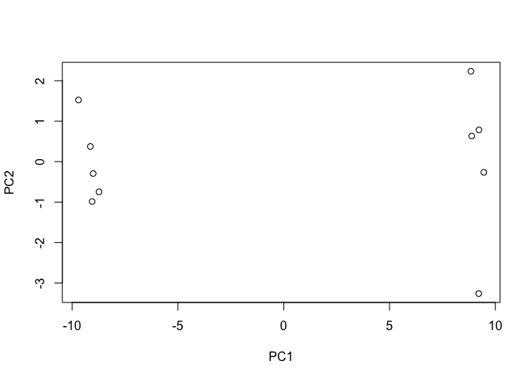
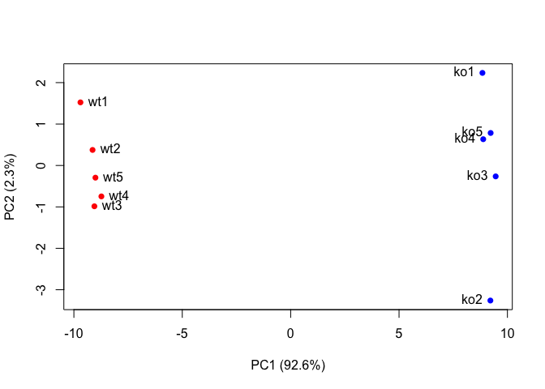

# class07
Gaeun Jun, A16814573

# Principal Component Analysis (PCA)

## PCA of UK food data

Read data from webstie and try a few visualizations.

``` r
url <- "https://tinyurl.com/UK-foods"
x <- read.csv(url)
x
```

                         X England Wales Scotland N.Ireland
    1               Cheese     105   103      103        66
    2        Carcass_meat      245   227      242       267
    3          Other_meat      685   803      750       586
    4                 Fish     147   160      122        93
    5       Fats_and_oils      193   235      184       209
    6               Sugars     156   175      147       139
    7      Fresh_potatoes      720   874      566      1033
    8           Fresh_Veg      253   265      171       143
    9           Other_Veg      488   570      418       355
    10 Processed_potatoes      198   203      220       187
    11      Processed_Veg      360   365      337       334
    12        Fresh_fruit     1102  1137      957       674
    13            Cereals     1472  1582     1462      1494
    14           Beverages      57    73       53        47
    15        Soft_drinks     1374  1256     1572      1506
    16   Alcoholic_drinks      375   475      458       135
    17      Confectionery       54    64       62        41

> Q1. How many rows and columns are in your new data frame named x? What
> R functions could you use to answer this questions?

``` r
nrow(x)
```

    [1] 17

``` r
ncol(x)
```

    [1] 5

There are 17 rows and 5 clumns in the new data frame named X. I used the
functions `nrow()` and `ncol()`.

``` r
View(x)
```

``` r
head(x)
```

                   X England Wales Scotland N.Ireland
    1         Cheese     105   103      103        66
    2  Carcass_meat      245   227      242       267
    3    Other_meat      685   803      750       586
    4           Fish     147   160      122        93
    5 Fats_and_oils      193   235      184       209
    6         Sugars     156   175      147       139

``` r
tail(x)
```

                       X England Wales Scotland N.Ireland
    12      Fresh_fruit     1102  1137      957       674
    13          Cereals     1472  1582     1462      1494
    14         Beverages      57    73       53        47
    15      Soft_drinks     1374  1256     1572      1506
    16 Alcoholic_drinks      375   475      458       135
    17    Confectionery       54    64       62        41

``` r
x <- read.csv(url, row.names=1)
x
```

                        England Wales Scotland N.Ireland
    Cheese                  105   103      103        66
    Carcass_meat            245   227      242       267
    Other_meat              685   803      750       586
    Fish                    147   160      122        93
    Fats_and_oils           193   235      184       209
    Sugars                  156   175      147       139
    Fresh_potatoes          720   874      566      1033
    Fresh_Veg               253   265      171       143
    Other_Veg               488   570      418       355
    Processed_potatoes      198   203      220       187
    Processed_Veg           360   365      337       334
    Fresh_fruit            1102  1137      957       674
    Cereals                1472  1582     1462      1494
    Beverages                57    73       53        47
    Soft_drinks            1374  1256     1572      1506
    Alcoholic_drinks        375   475      458       135
    Confectionery            54    64       62        41

> Q2. Which approach to solving the ‘row-names problem’ mentioned above
> do you prefer and why? Is one approach more robust than another under
> certain circumstances?

I prefer the row.names=1 because with the other approach, everytime I
use this code line, it removes the first column. But with row.names, I
can easily and consistently call the first row name to be 1.

``` r
barplot(as.matrix(x), beside=TRUE, col=rainbow(nrow(x)))
```


> Q3: Changing what optional argument in the above barplot() function
> results in the following plot?

``` r
barplot(as.matrix(x), col=rainbow(nrow(x)))
```


Changing the `beside` function to False or omitting that function would
give a stacked bar plot. True means that it would show up juxtaposed
(next to each other, and not on top).

> Q5: Generating all pairwise plots may help somewhat. Can you make
> sense of the following code and resulting figure? What does it mean if
> a given point lies on the diagonal for a given plot?

``` r
pairs(x, col=rainbow(10), pch=16)
```


Because each plot is a plot comparing a pair of two countries,
i.e. England and Wales, if the two countries have the same value of a
certain food, their value would lie right on top of each other. Meaning
that if all values were the same in the respective countries, all the
dots would be in a singular, straight, diagonal line.

> Q6. What is the main differences between N. Ireland and the other
> countries of the UK in terms of this data-set?

N. Ireland has more outliers in the higher end compared to other
countries, meaning that rather than being similar to the values of the
other countries, they vary a lot, given that visually the values are
nowhere near a straight, diagonal line.

### PCA to the rescue!!

The main base R PCA function is called `prcomp()` and we will need to
give it the transpose of our input data.

``` r
#t(x) transposes the rows and columns (switches them)
pca <- prcomp(t(x))
summary(pca)
```

    Importance of components:
                                PC1      PC2      PC3       PC4
    Standard deviation     324.1502 212.7478 73.87622 2.921e-14
    Proportion of Variance   0.6744   0.2905  0.03503 0.000e+00
    Cumulative Proportion    0.6744   0.9650  1.00000 1.000e+00

``` r
attributes(pca)
```

    $names
    [1] "sdev"     "rotation" "center"   "scale"    "x"       

    $class
    [1] "prcomp"

To make our new PCA plot (aka PCA score plot), we access `pca$x`.

> Q7. Complete the code below to generate a plot of PC1 vs PC2. The
> second line adds text labels over the data points.

``` r
# Plot PC1 vs PC2
plot(pca$x[,1], pca$x[,2], xlab="PC1", ylab="PC2", xlim=c(-270,500))
text(pca$x[,1], pca$x[,2], colnames(x))
```


> Q8. Customize your plot so that the colors of the country names match
> the colors in our UK and Ireland map and table at start of this
> document.

``` r
country_cols <- c("orange", "red", "blue", "green")
plot(pca$x[,1], pca$x[,2], xlab="PC1", ylab="PC2", xlim=c(-270,500))
text(pca$x[,1], pca$x[,2], colnames(x), col=country_cols)
```


``` r
v <- round( pca$sdev^2/sum(pca$sdev^2) * 100 )
v
```

    [1] 67 29  4  0

``` r
z <- summary(pca)
z$importance
```

                                 PC1       PC2      PC3          PC4
    Standard deviation     324.15019 212.74780 73.87622 2.921348e-14
    Proportion of Variance   0.67444   0.29052  0.03503 0.000000e+00
    Cumulative Proportion    0.67444   0.96497  1.00000 1.000000e+00

``` r
barplot(v, xlab="Principal Component", ylab="Percent Variation")
```


``` r
## Lets focus on PC1 as it accounts for > 90% of variance 
par(mar=c(10, 3, 0.35, 0))
barplot( pca$rotation[,1], las=2 )
```


> Q9: Generate a similar ‘loadings plot’ for PC2. What two food groups
> feature prominantely and what does PC2 maninly tell us about?

``` r
par(mar=c(10, 3, 0.35, 0))
barplot( pca$rotation[,2], las=2 )
```


The two groups that feature prominently are Fresh_potatoes that push the
other countries to the left side of the plot and Soft_drinks that push
N. Ireland to the right positive side of the plot. PC2 can tell us
something else about dietary consumption.

### Using ggplot for these figures

``` r
library(ggplot2)

df <- as.data.frame(pca$x)
df_lab <- tibble::rownames_to_column(df, "Country")

#Our first basic pot
ggplot(df_lab) + 
  aes(PC1, PC2, col=Country) +
  geom_point()
```


Making the plot look nicer

``` r
ggplot(df_lab) + 
  aes(PC1, PC2, col=Country, label=Country) + 
  geom_hline(yintercept = 0, col="gray") +
  geom_vline(xintercept = 0, col="gray") +
  geom_point(show.legend = FALSE) +
  geom_label(hjust=1, nudge_x = -10, show.legend = FALSE) +
  expand_limits(x = c(-300,500)) +
  xlab("PC1 (67.4%)") +
  ylab("PC2 (28%)") +
  theme_bw()
```


Do the same for the loadings/PC contributions figures.

``` r
ld <- as.data.frame(pca$rotation)
ld_lab <- tibble::rownames_to_column(ld, "Food")

ggplot(ld_lab) +
  aes(PC1, Food) +
  geom_col() 
```


Add features to the plots to make it look nicer and readable.

``` r
ggplot(ld_lab) +
  aes(PC1, reorder(Food, PC1), bg=PC1) +
  geom_col() + 
  xlab("PC1 Loadings/Contributions") +
  ylab("Food Group") +
  scale_fill_gradient2(low="purple", mid="gray", high="darkgreen", guide=NULL) +
  theme_bw()
```


### Using Biplots

Another way to put all these information together is using a biplot

``` r
## The inbuilt biplot() can be useful for small datasets 
biplot(pca)
```


## PCA of RNA-seq data

Read in data from website

``` r
url2 <- "https://tinyurl.com/expression-CSV"
rna.data <- read.csv(url2, row.names=1)
head(rna.data)
```

           wt1 wt2  wt3  wt4 wt5 ko1 ko2 ko3 ko4 ko5
    gene1  439 458  408  429 420  90  88  86  90  93
    gene2  219 200  204  210 187 427 423 434 433 426
    gene3 1006 989 1030 1017 973 252 237 238 226 210
    gene4  783 792  829  856 760 849 856 835 885 894
    gene5  181 249  204  244 225 277 305 272 270 279
    gene6  460 502  491  491 493 612 594 577 618 638

> Q10: How many genes and samples are in this data set?

``` r
nrow(rna.data)
```

    [1] 100

``` r
ncol(rna.data)
```

    [1] 10

There are 100 genes and 10 samples in this data set.

PCA and plotting

``` r
## Again we have to take the transpose of our data 
pca <- prcomp(t(rna.data), scale=TRUE)
summary(pca)
```

    Importance of components:
                              PC1    PC2     PC3     PC4     PC5     PC6     PC7
    Standard deviation     9.6237 1.5198 1.05787 1.05203 0.88062 0.82545 0.80111
    Proportion of Variance 0.9262 0.0231 0.01119 0.01107 0.00775 0.00681 0.00642
    Cumulative Proportion  0.9262 0.9493 0.96045 0.97152 0.97928 0.98609 0.99251
                               PC8     PC9      PC10
    Standard deviation     0.62065 0.60342 3.345e-15
    Proportion of Variance 0.00385 0.00364 0.000e+00
    Cumulative Proportion  0.99636 1.00000 1.000e+00

Do our PCA plot of this RNA-Seq data

``` r
## Simple un polished plot of pc1 and pc2
plot(pca$x[,1], pca$x[,2], xlab="PC1", ylab="PC2")
```



Adding text

``` r
plot(pca$x[,1], pca$x[,2], xlab="PC1", ylab="PC2")
text(pca$x[,1], pca$x[,2], colnames(rna.data))
```


Barplot of PCA

``` r
plot(pca, main="Quick scree plot")
```


``` r
## Variance captured per PC 
pca.var <- pca$sdev^2

## Percent variance is often more informative to look at 
pca.var.per <- round(pca.var/sum(pca.var)*100, 1)
pca.var.per
```

     [1] 92.6  2.3  1.1  1.1  0.8  0.7  0.6  0.4  0.4  0.0

Generating our own scree-plot

``` r
barplot(pca.var.per, main="Scree Plot", 
        names.arg = paste0("PC", 1:10),
        xlab="Principal Component", ylab="Percent Variation")
```


Making the PCA plot more aesthetic and nice

``` r
## A vector of colors for wt and ko samples
colvec <- colnames(rna.data)
colvec[grep("wt", colvec)] <- "red"
colvec[grep("ko", colvec)] <- "blue"

plot(pca$x[,1], pca$x[,2], col=colvec, pch=16,
     xlab=paste0("PC1 (", pca.var.per[1], "%)"),
     ylab=paste0("PC2 (", pca.var.per[2], "%)"))

text(pca$x[,1], pca$x[,2], labels = colnames(rna.data), pos=c(rep(4,5), rep(2,5)))
```



Using ggplot

``` r
library(ggplot2)

df <- as.data.frame(pca$x)

# Our first basic plot
ggplot(df) + 
  aes(PC1, PC2) + 
  geom_point()
```


Adding aesthetics and labels to ggplot to make plot readable

``` r
# Add a 'wt' and 'ko' "condition" column
df$samples <- colnames(rna.data) 
df$condition <- substr(colnames(rna.data),1,2)

p <- ggplot(df) + 
        aes(PC1, PC2, label=samples, col=condition) + 
        geom_label(show.legend = FALSE)
p
```


``` r
p + labs(title="PCA of RNASeq Data",
       subtitle = "PC1 clealy seperates wild-type from knock-out samples",
       x=paste0("PC1 (", pca.var.per[1], "%)"),
       y=paste0("PC2 (", pca.var.per[2], "%)"),
       caption="Class example data") +
     theme_bw()
```


### Gene loadings

Finding the top 10 measurements that contribute most to pc1 (either +/-)

``` r
loading_scores <- pca$rotation[,1]

## Find the top 10 measurements (genes) that contribute most to PC1 in either direction (+ or -)
gene_scores <- abs(loading_scores) 
gene_score_ranked <- sort(gene_scores, decreasing=TRUE)

## Show the names of the top 10 genes
top_10_genes <- names(gene_score_ranked[1:10])
top_10_genes 
```

     [1] "gene100" "gene66"  "gene45"  "gene68"  "gene98"  "gene60"  "gene21" 
     [8] "gene56"  "gene10"  "gene90" 
