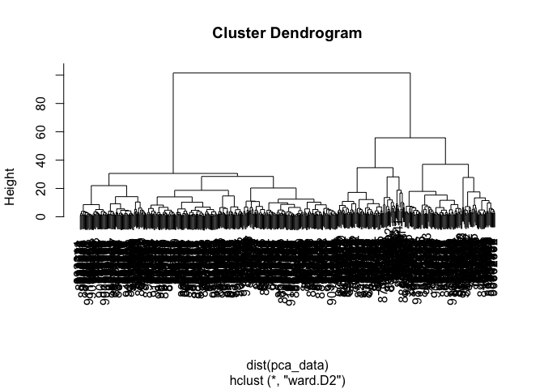
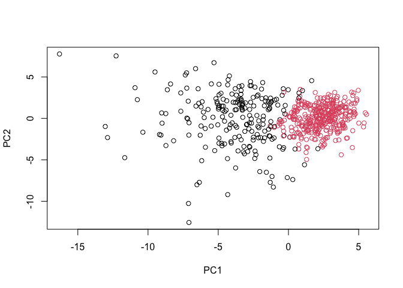
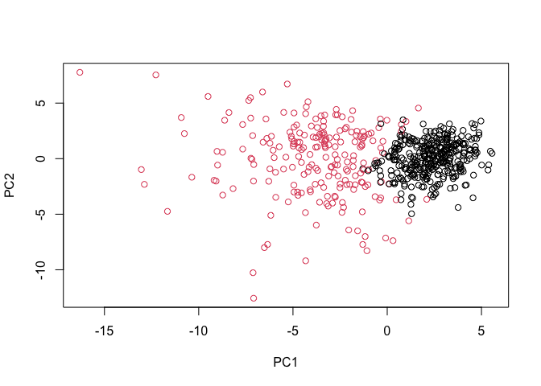
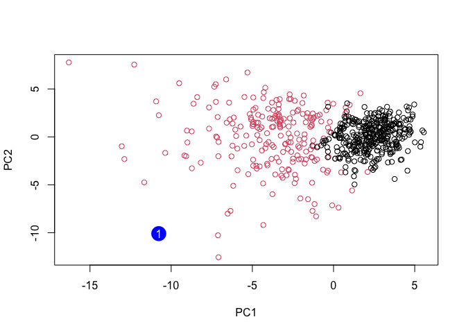

# mini-project
Gaeun Jun - A16814573

### 1. Exploratory data analysis

``` r
# Save your input data file into your Project directory
fna.data <- "https://bioboot.github.io/bimm143_S20/class-material/WisconsinCancer.csv"
```

``` r
# Complete the following code to input the data and store as wisc.df
wisc.df <- read.csv(fna.data, row.names=1)
```

``` r
head(wisc.df)
```

             diagnosis radius_mean texture_mean perimeter_mean area_mean
    842302           M       17.99        10.38         122.80    1001.0
    842517           M       20.57        17.77         132.90    1326.0
    84300903         M       19.69        21.25         130.00    1203.0
    84348301         M       11.42        20.38          77.58     386.1
    84358402         M       20.29        14.34         135.10    1297.0
    843786           M       12.45        15.70          82.57     477.1
             smoothness_mean compactness_mean concavity_mean concave.points_mean
    842302           0.11840          0.27760         0.3001             0.14710
    842517           0.08474          0.07864         0.0869             0.07017
    84300903         0.10960          0.15990         0.1974             0.12790
    84348301         0.14250          0.28390         0.2414             0.10520
    84358402         0.10030          0.13280         0.1980             0.10430
    843786           0.12780          0.17000         0.1578             0.08089
             symmetry_mean fractal_dimension_mean radius_se texture_se perimeter_se
    842302          0.2419                0.07871    1.0950     0.9053        8.589
    842517          0.1812                0.05667    0.5435     0.7339        3.398
    84300903        0.2069                0.05999    0.7456     0.7869        4.585
    84348301        0.2597                0.09744    0.4956     1.1560        3.445
    84358402        0.1809                0.05883    0.7572     0.7813        5.438
    843786          0.2087                0.07613    0.3345     0.8902        2.217
             area_se smoothness_se compactness_se concavity_se concave.points_se
    842302    153.40      0.006399        0.04904      0.05373           0.01587
    842517     74.08      0.005225        0.01308      0.01860           0.01340
    84300903   94.03      0.006150        0.04006      0.03832           0.02058
    84348301   27.23      0.009110        0.07458      0.05661           0.01867
    84358402   94.44      0.011490        0.02461      0.05688           0.01885
    843786     27.19      0.007510        0.03345      0.03672           0.01137
             symmetry_se fractal_dimension_se radius_worst texture_worst
    842302       0.03003             0.006193        25.38         17.33
    842517       0.01389             0.003532        24.99         23.41
    84300903     0.02250             0.004571        23.57         25.53
    84348301     0.05963             0.009208        14.91         26.50
    84358402     0.01756             0.005115        22.54         16.67
    843786       0.02165             0.005082        15.47         23.75
             perimeter_worst area_worst smoothness_worst compactness_worst
    842302            184.60     2019.0           0.1622            0.6656
    842517            158.80     1956.0           0.1238            0.1866
    84300903          152.50     1709.0           0.1444            0.4245
    84348301           98.87      567.7           0.2098            0.8663
    84358402          152.20     1575.0           0.1374            0.2050
    843786            103.40      741.6           0.1791            0.5249
             concavity_worst concave.points_worst symmetry_worst
    842302            0.7119               0.2654         0.4601
    842517            0.2416               0.1860         0.2750
    84300903          0.4504               0.2430         0.3613
    84348301          0.6869               0.2575         0.6638
    84358402          0.4000               0.1625         0.2364
    843786            0.5355               0.1741         0.3985
             fractal_dimension_worst
    842302                   0.11890
    842517                   0.08902
    84300903                 0.08758
    84348301                 0.17300
    84358402                 0.07678
    843786                   0.12440

Creating an unsupervised data set that doesn’t contain the diagnosis.

``` r
# Using -1 to remove the first column of diagnosis
wisc.data <- wisc.df[,-1]
```

Creating a diagnosis vector that contains the diagnosis column.

``` r
diagnosis <- wisc.df[,1]
diagnosis <- as.factor(diagnosis)
```

> Q1. How many observations are in this dataset?

``` r
nrow(wisc.data)
```

    [1] 569

There are 569 observations in the wisc.data dataset.

> Q2. How many of the observations have a malignant diagnosis?

``` r
table(diagnosis)
```

    diagnosis
      B   M 
    357 212 

212 of the observations have a malignant diagnosis.

> Q3. How many variables/features in the data are suffixed with \_mean?

``` r
column_indices <- grep("_mean", colnames(wisc.data))
which_column <- colnames(wisc.data)[column_indices]
which_column
```

     [1] "radius_mean"            "texture_mean"           "perimeter_mean"        
     [4] "area_mean"              "smoothness_mean"        "compactness_mean"      
     [7] "concavity_mean"         "concave.points_mean"    "symmetry_mean"         
    [10] "fractal_dimension_mean"

``` r
length(which_column)
```

    [1] 10

There are 10 variables/features in the data that are suffixed with
“\_mean”.

### 2. Principal Component Analysis

##### Performing PCA

Checking the mean and standard deviations of the wisc.data columns.

``` r
# Check column means and standard deviations
colMeans(wisc.data)
```

                radius_mean            texture_mean          perimeter_mean 
               1.412729e+01            1.928965e+01            9.196903e+01 
                  area_mean         smoothness_mean        compactness_mean 
               6.548891e+02            9.636028e-02            1.043410e-01 
             concavity_mean     concave.points_mean           symmetry_mean 
               8.879932e-02            4.891915e-02            1.811619e-01 
     fractal_dimension_mean               radius_se              texture_se 
               6.279761e-02            4.051721e-01            1.216853e+00 
               perimeter_se                 area_se           smoothness_se 
               2.866059e+00            4.033708e+01            7.040979e-03 
             compactness_se            concavity_se       concave.points_se 
               2.547814e-02            3.189372e-02            1.179614e-02 
                symmetry_se    fractal_dimension_se            radius_worst 
               2.054230e-02            3.794904e-03            1.626919e+01 
              texture_worst         perimeter_worst              area_worst 
               2.567722e+01            1.072612e+02            8.805831e+02 
           smoothness_worst       compactness_worst         concavity_worst 
               1.323686e-01            2.542650e-01            2.721885e-01 
       concave.points_worst          symmetry_worst fractal_dimension_worst 
               1.146062e-01            2.900756e-01            8.394582e-02 

``` r
apply(wisc.data,2,sd)
```

                radius_mean            texture_mean          perimeter_mean 
               3.524049e+00            4.301036e+00            2.429898e+01 
                  area_mean         smoothness_mean        compactness_mean 
               3.519141e+02            1.406413e-02            5.281276e-02 
             concavity_mean     concave.points_mean           symmetry_mean 
               7.971981e-02            3.880284e-02            2.741428e-02 
     fractal_dimension_mean               radius_se              texture_se 
               7.060363e-03            2.773127e-01            5.516484e-01 
               perimeter_se                 area_se           smoothness_se 
               2.021855e+00            4.549101e+01            3.002518e-03 
             compactness_se            concavity_se       concave.points_se 
               1.790818e-02            3.018606e-02            6.170285e-03 
                symmetry_se    fractal_dimension_se            radius_worst 
               8.266372e-03            2.646071e-03            4.833242e+00 
              texture_worst         perimeter_worst              area_worst 
               6.146258e+00            3.360254e+01            5.693570e+02 
           smoothness_worst       compactness_worst         concavity_worst 
               2.283243e-02            1.573365e-01            2.086243e-01 
       concave.points_worst          symmetry_worst fractal_dimension_worst 
               6.573234e-02            6.186747e-02            1.806127e-02 

``` r
# Perform PCA on wisc.data
wisc.data <- scale(wisc.data)
wisc.pr <- prcomp(wisc.data)
```

``` r
# Look at summary of results
summary(wisc.pr)
```

    Importance of components:
                              PC1    PC2     PC3     PC4     PC5     PC6     PC7
    Standard deviation     3.6444 2.3857 1.67867 1.40735 1.28403 1.09880 0.82172
    Proportion of Variance 0.4427 0.1897 0.09393 0.06602 0.05496 0.04025 0.02251
    Cumulative Proportion  0.4427 0.6324 0.72636 0.79239 0.84734 0.88759 0.91010
                               PC8    PC9    PC10   PC11    PC12    PC13    PC14
    Standard deviation     0.69037 0.6457 0.59219 0.5421 0.51104 0.49128 0.39624
    Proportion of Variance 0.01589 0.0139 0.01169 0.0098 0.00871 0.00805 0.00523
    Cumulative Proportion  0.92598 0.9399 0.95157 0.9614 0.97007 0.97812 0.98335
                              PC15    PC16    PC17    PC18    PC19    PC20   PC21
    Standard deviation     0.30681 0.28260 0.24372 0.22939 0.22244 0.17652 0.1731
    Proportion of Variance 0.00314 0.00266 0.00198 0.00175 0.00165 0.00104 0.0010
    Cumulative Proportion  0.98649 0.98915 0.99113 0.99288 0.99453 0.99557 0.9966
                              PC22    PC23   PC24    PC25    PC26    PC27    PC28
    Standard deviation     0.16565 0.15602 0.1344 0.12442 0.09043 0.08307 0.03987
    Proportion of Variance 0.00091 0.00081 0.0006 0.00052 0.00027 0.00023 0.00005
    Cumulative Proportion  0.99749 0.99830 0.9989 0.99942 0.99969 0.99992 0.99997
                              PC29    PC30
    Standard deviation     0.02736 0.01153
    Proportion of Variance 0.00002 0.00000
    Cumulative Proportion  1.00000 1.00000

> Q4. From your results, what proportion of the original variance is
> captured by the first principal components (PC1)?

0.4427 is captured by PC1.

> Q5. How many principal components (PCs) are required to describe at
> least 70% of the original variance in the data?

0.4427 + 0.1897 + 0.09393 = 0.726. 3 principal components are required
to describe at least 70% of the original variance in the data.

> Q6. How many principal components (PCs) are required to describe at
> least 90% of the original variance in the data?

0.4427 + 0.1897 + 0.09393 + 0.06602 + 0.05496 + 0.04025 + 0.02251 =
0.91007. 7 principal components are required to describe at least 90% of
the original variance in the data.

##### Interpreting PCA results

``` r
biplot(wisc.pr)
```


> Q7. What stands out to you about this plot? Is it easy or difficult to
> understand? Why?

Something that stands out to me about this plot is how much clutter
there is, making it impossible to read any of the features. It is
difficult to understand because there are so many elements in the plot
and overlaps that it is not rational to try to comprehend the plot.

Generating a plot that’s easier to see.

``` r
# Scatter plot observations by components 1 and 2
plot(wisc.pr$x[,1], wisc.pr$x[,2], col = diagnosis, 
     xlab = "PC1", ylab = "PC2")
```


> Q8. Generate a similar plot for principal components 1 and 3. What do
> you notice about these plots?

``` r
plot(wisc.pr$x[,1], wisc.pr$x[,3], col = diagnosis,
     xlab = "PC1", ylab = "PC3")
```


Compared to the plot for principal components 1 and 2, this plot seems
to have shifted down and slightly more cluttered. This is because PC2
describes more variance in the original data.

##### Using the ggplot2 package

``` r
df <- as.data.frame(wisc.pr$x)
df$diagnosis <- diagnosis

library(ggplot2)

ggplot(df) +
  aes(PC1, PC2, col=diagnosis) +
  geom_point()
```


##### Variance explained

``` r
# Calculating the variance of each principal component
pr.var <- wisc.pr$sdev^2
head(pr.var)
```

    [1] 13.281608  5.691355  2.817949  1.980640  1.648731  1.207357

``` r
# Variance explained by each principal component: pve
pve <- pr.var / sum(pr.var)
  
# Plot variance explained for each principal component
plot(pve, xlab = "Principal Component", 
     ylab = "Proportion of Variance Explained", 
     ylim = c(0, 1), type = "o")
```


``` r
# Alternative scree plot of the same data, note data driven y-axis
barplot(pve, ylab = "Precent of Variance Explained",
     names.arg=paste0("PC",1:length(pve)), las=2, axes = FALSE)
axis(2, at=pve, labels=round(pve,2)*100 )
```


CRAN packages

``` r
## ggplot based graph
library(factoextra)
```

    Welcome! Want to learn more? See two factoextra-related books at https://goo.gl/ve3WBa

``` r
fviz_eig(wisc.pr, addlabels = TRUE)
```


### Communicating PCA results

> Q9. For the first principal component, what is the component of the
> loading vector (i.e. wisc.pr\$rotation\[,1\]) for the feature
> concave.points_mean?

``` r
wisc.pr$rotation["concave.points_mean", 1]
```

    [1] -0.2608538

-0.261

> Q10. What is the minimum number of principal components required to
> explain 80% of the variance of the data?

Using the scree plot, I can calculate how many PC add up to explain at
least 80% of the variance of the data: 44.3 + 19 + 9.4 + 6.6 + 5.5 =
84.8. You need at least 5 principal components.

### Hierarchial clustering

``` r
# Scale the wisc.data data using the "scale()" function
data.scaled <- scale(wisc.data)
```

``` r
# Calculate the distances between all pairs of observations
data.dist <- dist(data.scaled)
```

``` r
# Create a hierarchical clustering model using complete linkage
wisc.hclust <- hclust(data.dist, method = "complete")
```

##### Results of hierarchial clustering

> Q11. Using the plot() and abline() functions, what is the height at
> which the clustering model has 4 clusters?

``` r
plot(wisc.hclust)
abline(h=19, col="red", lty=2)
```


At height = 19, the clustering model has 4 clusters

##### Selecting number of clusters

Using `cutree()` to cut the tree so that it has 4 clusters.

``` r
wisc.hclust.clusters <- cutree(wisc.hclust, k=4)
```

``` r
table(wisc.hclust.clusters, diagnosis)
```

                        diagnosis
    wisc.hclust.clusters   B   M
                       1  12 165
                       2   2   5
                       3 343  40
                       4   0   2

``` r
wisc.hclust.clusters_test <- cutree(wisc.hclust, k=5)
table(wisc.hclust.clusters_test, diagnosis)
```

                             diagnosis
    wisc.hclust.clusters_test   B   M
                            1  12 165
                            2   0   5
                            3 343  40
                            4   2   0
                            5   0   2

> Q12. Can you find a better cluster vs diagnoses match by cutting into
> a different number of clusters between 2 and 10?

When I cut the amount of clusters to 5 clusters I get a better match
because cluster 2 shows a clearer distinction between malignant and
benign cases (while the other clusters remain the same) while cluster 2
in the 4 clusters show less of a variance.

##### Using different methods

> Q13. Which method gives your favorite results for the same data.dist
> dataset? Explain your reasoning.

``` r
methods <- c("single", "complete", "average", "ward.D2")

results <- list()

# Loop through the methods and store the clusters
for (method in methods) {
  # Create the hierarchical clustering model
  hclust_model <- hclust(data.dist, method = method)
  
  clusters <- cutree(hclust_model, k = 4)
  
  results[[method]] <- table(clusters, diagnosis)
}

results
```

    $single
            diagnosis
    clusters   B   M
           1 356 209
           2   1   0
           3   0   2
           4   0   1

    $complete
            diagnosis
    clusters   B   M
           1  12 165
           2   2   5
           3 343  40
           4   0   2

    $average
            diagnosis
    clusters   B   M
           1 355 209
           2   2   0
           3   0   1
           4   0   2

    $ward.D2
            diagnosis
    clusters   B   M
           1   0 115
           2   6  48
           3 337  48
           4  14   1

Out of these methods, the “complete” and “ward.D2” methods give me the
best results because they show the clearest distinction between the
benign and malignant cases. However, it’s hard to compare these two
because while one might have a bigger discrepancy between the two, the
other has a clearer indication that a certain cluster corresponds to
either malignant or benign cells.

### OPTIONAL: K-means clustering

##### K-means clustering and comparing results

Creating a k-means model on wisc.data

``` r
scaled_data <- scale(wisc.data)
wisc.km <- kmeans(scaled_data, centers= 2, nstart= 20)
```

``` r
table(wisc.km$cluster, diagnosis)
```

       diagnosis
          B   M
      1  14 175
      2 343  37

> Q14. How well does k-means separate the two diagnoses? How does it
> compare to your hclust results?

``` r
wisc.hclust.clusters.2 <- cutree(wisc.hclust, k=2)
table(wisc.hclust.clusters.2, diagnosis)
```

                          diagnosis
    wisc.hclust.clusters.2   B   M
                         1 357 210
                         2   0   2

Compared to the hclust results, k-means definitely separates the two
diagnoses a lot better, because the first cluster clearly shows an
indication towards benign cells and cluster 2 showing an indication
towards malignant cells. In the hclust results, when I use 2 clusters,
the first cluster is pretty divided between the two cells.

``` r
table(wisc.hclust.clusters, wisc.km$cluster)
```

                        
    wisc.hclust.clusters   1   2
                       1 160  17
                       2   7   0
                       3  20 363
                       4   2   0

### 5. Combining methods

##### Clustering on PCA results

``` r
pca_result <- prcomp(scaled_data, center = TRUE, scale. = TRUE)

pve <- summary(pca_result)$importance[3, ]
components_needed <- which(pve >= 0.90)[1]

pca_data <- pca_result$x[, 1:components_needed]

wisc.pr.hclust <- hclust(dist(pca_data), method = "ward.D2")

plot(wisc.pr.hclust)
```



``` r
grps <- cutree(wisc.pr.hclust, k=2)
table(grps)
```

    grps
      1   2 
    216 353 

``` r
table(grps, diagnosis)
```

        diagnosis
    grps   B   M
       1  28 188
       2 329  24

``` r
plot(wisc.pr$x[,1:2], col=grps)
```



``` r
plot(wisc.pr$x[,1:2], col=diagnosis)
```


Swapping the colors of the clusters, such that cluster 2 comes first

``` r
g <- as.factor(grps)
levels(g)
```

    [1] "1" "2"

``` r
g <- relevel(g,2)
levels(g)
```

    [1] "2" "1"

``` r
# Plot using our re-ordered factor 
plot(wisc.pr$x[,1:2], col=g)
```



``` r
## Use the distance along the first 7 PCs for clustering
wisc.pr.hclust <- hclust(dist(wisc.pr$x[, 1:7]), method="ward.D2")
```

``` r
wisc.pr.hclust.clusters <- cutree(wisc.pr.hclust, k=2)
```

``` r
table(wisc.pr.hclust.clusters, diagnosis)
```

                           diagnosis
    wisc.pr.hclust.clusters   B   M
                          1  28 188
                          2 329  24

> Q15. How well does the newly created model with four clusters separate
> out the two diagnoses?

It separates out the four clusters as the same as k-means. It separates
it out pretty well as the first cluster indicates malignant cells and
the second cluster indicates benign cells.

> Q16. How well do the k-means and hierarchical clustering models you
> created in previous sections (i.e. before PCA) do in terms of
> separating the diagnoses? Again, use the table() function to compare
> the output of each model (wisc.km\$cluster and wisc.hclust.clusters)
> with the vector containing the actual diagnoses.

``` r
table(wisc.km$cluster, diagnosis)
```

       diagnosis
          B   M
      1  14 175
      2 343  37

``` r
table(wisc.hclust.clusters, diagnosis)
```

                        diagnosis
    wisc.hclust.clusters   B   M
                       1  12 165
                       2   2   5
                       3 343  40
                       4   0   2

Both k-means and hierarchial clustering can separate the diagnosis well,
because each cluster tends to lean towards a diagnosis with a good
proportion. Even ward.d2 can separate the diagnosis well.

### 6. Sensitivity/Specificity

Sensitivity: cluster with predominantly malignant cells / total number
of known malignant samples

``` r
sum(diagnosis == "M")
```

    [1] 212

The different methods/procedures for sensitivity:

hcluster: 165/212 = 0.778

k-means: 175/212 = 0.825

K-means results in a clustering model with the best sensitivity.

Specificity: cluster with predominantly benign cells / total number of
known benign samples

``` r
sum(diagnosis == "B")
```

    [1] 357

hcluster: 343/357 = .961

k-means: 343/357 = .961

Both hcluster and k-means result in a clustering model with the best
specificity.

### 7. Prediction

``` r
#url <- "new_samples.csv"
url <- "https://tinyurl.com/new-samples-CSV"
new <- read.csv(url)
npc <- predict(wisc.pr, newdata=new)
npc
```

               PC1        PC2        PC3       PC4      PC5       PC6        PC7
    [1,] -10.76452 -10.093978 -0.5897994 -4.164748 10.61922 -1.630738 0.03566861
    [2,] -18.09606  -9.967098 -2.1549431 -4.006848  6.69687 -2.034714 1.25088149
               PC8       PC9     PC10       PC11     PC12       PC13      PC14
    [1,] 0.7308658 -1.580861 3.166451 -0.7167150 3.850569 -0.8259764 1.0195729
    [2,] 0.6308585 -1.155629 3.608207 -0.3405375 2.288732 -0.3976672 0.1347203
             PC15      PC16      PC17      PC18     PC19      PC20      PC21
    [1,] 3.735687 -4.068783 1.0877034 0.9985959 1.022760 -2.430215 -1.295749
    [2,] 3.543905 -3.749616 0.7613603 1.1763217 1.366702 -2.609643 -1.541050
              PC22       PC23      PC24       PC25      PC26      PC27       PC28
    [1,] -1.348026 -0.7388274 -1.083000 -0.4220831 -1.892993 -1.176056 0.05527974
    [2,] -1.424290 -0.7591376 -1.439202 -0.6508838 -1.981711 -1.397390 0.18112357
              PC29       PC30
    [1,] 0.2658028 0.05162840
    [2,] 0.2842191 0.02734355

``` r
plot(wisc.pr$x[,1:2], col=g)
points(npc[,1], npc[,2], col="blue", pch=16, cex=3)
text(npc[,1], npc[,2], c(1,2), col="white")
```



> Q18. Which of these new patients should we prioritize for follow up
> based on your results?

Patient 2 should prioritize for follow-up because they have more
malignant cells while patient 1 has benign cells.
